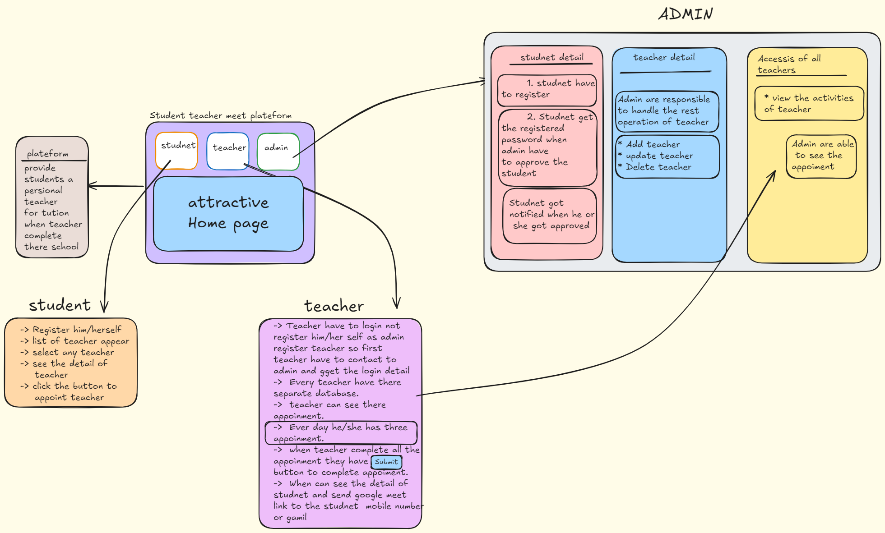

> flow Chart



> System Modules

### Admin

- Add Teacher
  - Name, Department, subject, etc
- Update/Delete Teacher
- Approve Registration Student

### Teacher

- Login
- Schedule Appointment
- Approve/cancel Appointment
- View Messages
- View All Appointment
- Logout

### Student

- Register
- Login
- Search Teacher
- Book Appointment
  - Send Message

> Database:

- I have used `FireBase`

> Visual Representation

<div style={{display:'flex'}}>
<div>

> 

</div>
<div>

> 

</div>
</div>
<hr />

> Purpose of the Web Project ✨

Booking appointment systems, either online or through traditional queueing
systems, are now popular. Several businesses, such as scheduling an appointment,
employ various Web-based appointment systems for their patients, which improve
the efficiency of the appointment process, reducing patient wait times and
increasing the total number of patients treated. This research proposes a web
based appointment booking system that allows students and lecturers to be aware
of their appointment time regardless of where they are by using the web or mobile
devices. By connecting to the Internet, students and instructors can easily access
the system. It also permits students to send any message, including the
appointment's purpose and timing

- `Enhance communication between students and mentors` by providing an efficient appointment scheduling system.
- `implify administrative tasks for mentors`, allowing them to manage student requests and appointments effortlessly.
- `Promote personalized learning`, offering students direct access to mentor advice, feedback, and mentorship.
- `Support growth and learning` by fostering better engagement between students and their mentors through structured, easy-to-manage interactions.

<hr />

> How to clone project

1. Go to your terminal and type following code are as follow.

```
git clone https://github.com/devsany/Student-Teacher-Booking-Appointment.git
```

2. Install all the dependancies.

```
npm install //it will install all the required dependency.
```

3. Set up **`Firebase`**
   - Go to [`Firebase`](#https://firebase.google.com/) website.
   - SignUp as Studnet.
   - Create project.
   - Name the project.
   - Go to project console.
   - Go to `realtime database`.
   - Go to the setting of the project.
   - Copy all the `Console Code`.
4. Make a `folder📁` in `src📁` name `firebase`.
5. Make a `file🗄` in `firebase📁` name `firebaseconsole`.
6. Open `terminal` and Run Command.

```
npm run dev
```
